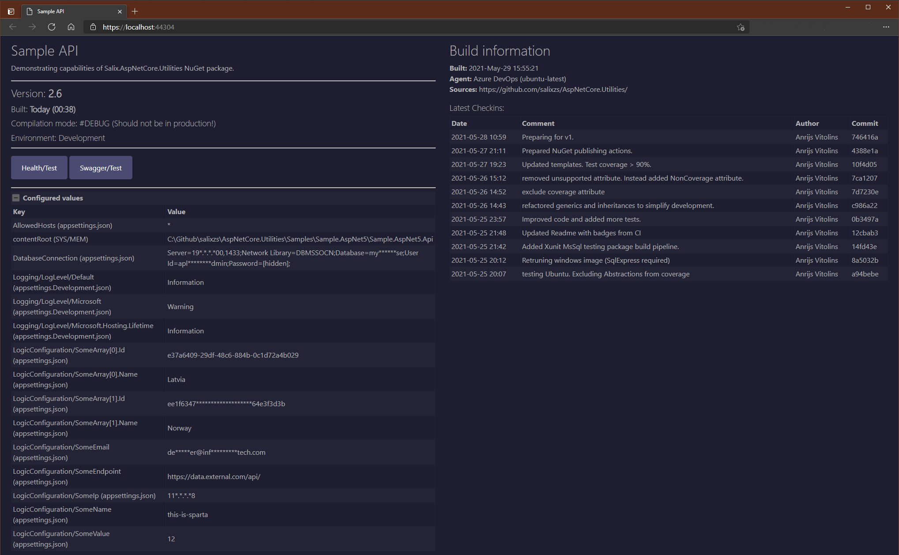
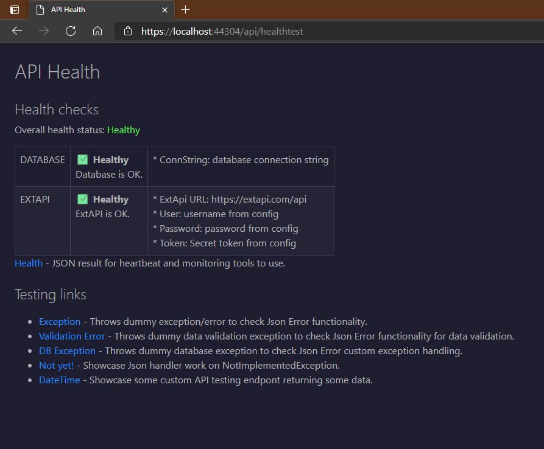

# Pages

There are two pages available for API to display for its consumers, who would like to see some information on your API within browser.

* **ROOT** (available at root path)
* **Health/Test** (visualize Health checks + provide defined links)

## ROOT page
Page, which is available at root path (see AddressBar in picture below) with some very basic and technical information on API.



### Usage

To return any content from API, there is a need for controller (which we can have in API). For first page - ROOT page, just create/use normal `HomeController` with action (method) in it which serves root ("/"). Int this action some preparation work needs to be done - some values to be passed for page content generator:

```csharp
[ApiController]
[ApiExplorerSettings(IgnoreApi = true)]
public class HomeController : ControllerBase
{
    private readonly IWebHostEnvironment _hostingEnvironment;
    
    public HomeController(IWebHostEnvironment hostingEnvironment)
    {
        _hostingEnvironment = hostingEnvironment;
    }

    /// <summary>
    /// Retrieves simple frontend/index page to display when API is open on its base URL.
    /// </summary>
    [HttpGet("/")]
    public ContentResult Index()
    {
        IndexPageValues buildData = new()
        {
            ApiName = "Sample API",
            Description = "Demonstrating capabilities of Salix.AspNetCore.Utilities NuGet package.",
            HostingEnvironment = _hostingEnvironment.EnvironmentName,
            Version = "1.0"
            BuiltTime = DateTime.Now
            HealthPageAddress = "/api/health",
            SwaggerPageAddress = "/swagger"
        };

// "Hacking" to understand what mode API is getting compiled.
#if DEBUG
        buildData.BuildMode = "#DEBUG (Should not be in production!)";
#else
        buildData.BuildMode = "Release";
#endif

        // Should return as ContentResult for browser to understand it shoulld display it as HTML page.
        return new ContentResult
        {
            ContentType = "text/html",
            StatusCode = (int)HttpStatusCode.OK,
            // This is where page is getting its contents
            Content = IndexPage.GetContents(buildData),
        };
    }
}
```

Let's walk through code.

First - you would want to add `[ApiExplorerSettings(IgnoreApi = true)]` on Home controller to avoid it being added to Swagger generated true API endpoints.

Page needs some of that technical and descriptive data to display on it, so here it should be prepared into `IndexPageValues` data contract. There are many possibilities where to get those values, some of them are described below, but as those are mostly strings - they can be hardcoded for simplest approach.

##### ApiName
Quite self-descriptive. Use your API name here.

##### Description
Provide any description for your API. Entire text will be shown right under API name in page.

##### HostingEnvironment
For this I suggest to use approach provided in code sample above - get it from Asp.Net IWebHostEnvironment data.

##### Version
For displaying version number, it can be added and changed here manually each time new version is pushed to production. If you have your versioning solution - you can get version from there. 

Another possibility is to extract version from Assembly. Standard boilerplate is adding this automatically during compilation (and is always 1.0.0.0). To control this number, you should modify `*api*.csproj` file to prevent automatically generating default `AssemblyInfo.cs` file and add this file to project yourself in project root. Then in this file you can put version number and increment it when needed.
Here is such file example:
```csharp
using System.Reflection;

// To make these work you should add special tags in CSPROJ file.

[assembly: AssemblyDescription("Sample API")]
[assembly: AssemblyCompany("MyCompany")]
[assembly: AssemblyProduct("MyCompany.SampleApi")]
[assembly: AssemblyVersion("2.6.*")]
// or
[assembly: AssemblyVersion("2.6.1.12")]
```

In sample above shown two approaches on how to specify AssemblyVersion. First (with *) will automatically generate last two numbers, but they are not something auto-incremental. These numbers encodes build date/time (to which we will get later). Version without * will specify entire version number - hardcoded way.

To use this file, add these lines in `csproj` file:

```xml
<Project Sdk="Microsoft.NET.Sdk.Web">
  <PropertyGroup>
    <TargetFramework>net5.0</TargetFramework>
    
    <!--To use included custom AssemblyInfo.cs file (and prevent autogenerate default during compilation)-->
    <GenerateAssemblyInfo>false</GenerateAssemblyInfo>
    <!--Allow wildcards in version number inside AssemblyInfo.cs == generates magic numbers to specify compilation datetime. -->
    <Deterministic>false</Deterministic>
  </PropertyGroup>
  ...
```

if these preparations are applied and used, there is a method in IndexPage and version setting changes to:

```csharp
var apiAssembly = Assembly.GetAssembly(typeof(Startup));
...
Version = IndexPage.ExtractVersionFromAssembly(apiAssembly, 2), // Takes version from assembly - just first two numbers as specified
```

##### BuiltTime
It is a DateTime to be set, indicating when API was built. You can change it manually before going to production, like `BuiltTime = new DateTime(2021, 4, 3)` or to avoid it being shown - put there `DateTime.MinValue`.

Now, to use this magic with Assembly version number with * (see above "Version"), you can use another method in IndexPage:

```csharp
BuiltTime = IndexPage.ExtractBuildTimeFromAssembly(apiAssembly)
```

##### BuildMode

Shows what build configuration was used to build API. Code example above shows how content of this string can be controlled by using build time variables, defined in project/Visual Studio.

##### HealthPageAddress

Is simply address URL (relative) where another page is located. When this is specified - button appears on page with link to that page.

##### SwaggerPageAddress

Is similar to HealthPageAddress, but should be populated if you use Swagger with your API and it should point to URL, where Swagger UI (or Json) is available.


After all this is prepared, just compose ContentResult object and return it from controller action:

```csharp
return new ContentResult
{
    ContentType = "text/html",
    StatusCode = (int)HttpStatusCode.OK,
    Content = IndexPage.GetContents(buildData),
};
```


## Health / Test page
This page should be used only if you have at least one HealthCheck configured for your API.
There are many HealthChecks for components and external systems available at [this GitHub repository](https://github.com/Xabaril/AspNetCore.Diagnostics.HealthChecks).



### Usage
The same as for Root page - we need a controller to supply this page contents, as well we need to prepare something for its content generation:

```csharp
[ApiController]
[ApiExplorerSettings(IgnoreApi = true)]
public class SomeController : ControllerBase
{
    private readonly HealthCheckService _healthChecks;

    public SomeController(HealthCheckService healthChecks) =>
        _healthChecks = healthChecks;

    [HttpGet("/api/healthtest")]
    public async Task<ContentResult> HealthTest()
    {
        HealthReport healthResult = await _healthChecks.CheckHealthAsync().ConfigureAwait(false);
        return new ContentResult
        {
            ContentType = "text/html",
            StatusCode = (int)HttpStatusCode.OK,
            Content = HealthTestPage.GetContents(
                healthResult, 
                "/api/health",
                new List<HealthTestPageLink>
                {
                    new HealthTestPageLink { TestEndpoint = "/api/sample/exception", Name = "Exception", Description = "Throws dummy exception/error to check error behavior." },
                    new HealthTestPageLink { TestEndpoint = "/api/sample/anytest", Name = "DateTime", Description = "Showcase some custom API testing endpont returning some data." }
                }),
        };
    }
}
```

First we have to get HealthReport from Asp.net HealthCheck routines and then supply this report for `HealthTestPage.GetContents()` method.

Second URL parameter should be same as specified when configuring HealthCheck endpoint - it is where HealthCheck standard output is located. 

Third parameter are listing custom endpoints to display below HealthCheck results, listing anything you want to expose as part of this page. Normally those would be some general testing or description endpoints. If you omit this parameter or supply empty list - page will not display this section.
