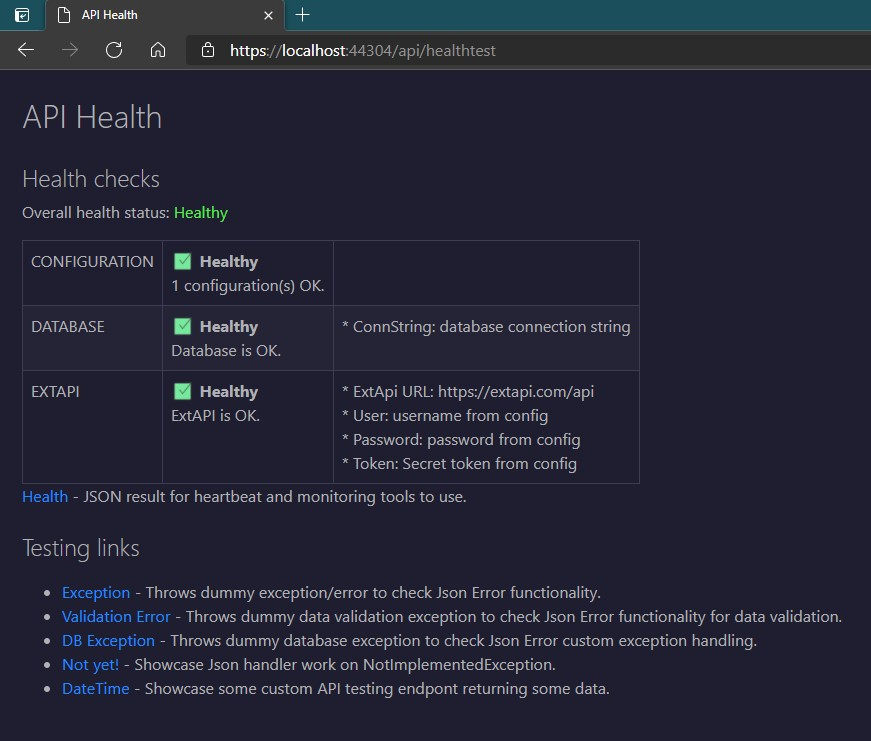

# Pages

There are two pages available for API to display for its consumers, who would like to see some information on your API within browser.

* **ROOT** (available at root path)
* [**Health/Test**](#health--test-page) (visualize Health checks + provide defined links)

## ROOT page
There is a possibility to create frontend (index) page for API to display when its root URL is open in a browser. Without any supplied information, it is very simple one:


Putting a little bit more effort, supplying some data to page renderer, it becomes very technically informative:


### Usage

To return any content from API, there is a need for controller (which we can have in API). For first page - ROOT page, just create/use normal `HomeController` with action (method) in it which serves root ("/"). Int this action some preparation work needs to be done - some values to be passed for page content generator:

```csharp
[ApiController]
[ApiExplorerSettings(IgnoreApi = true)]
public class HomeController : ControllerBase
{
    private readonly IWebHostEnvironment _hostingEnvironment;
    private readonly IConfigurationValuesLoader _configLoader;
    
    public HomeController(IWebHostEnvironment hostingEnvironment, IConfigurationValuesLoader configLoader)
    {
        _hostingEnvironment = hostingEnvironment;
        _configLoader = configLoader;
    }

    /// <summary>
    /// Retrieves simple frontend/index page to display when API is open on its base URL.
    /// </summary>
    [HttpGet("/")]
    public ContentResult Index()
    {
       // Load filtered configuration items from entire configuration based on given whitelist filter
            Dictionary<string, string> configurationItems =
                _configLoader.GetConfigurationValues(new HashSet<string>
                {
                    "AllowedHosts", "contentRoot", "Logging", "LogicConfiguration"
                });

            var apiAssembly = Assembly.GetAssembly(typeof(Startup));
            IndexPage indexPage = new IndexPage("Sample API")
                .SetDescription("Demonstrating capabilities of Salix.AspNetCore.Utilities NuGet package.")
                .SetHostingEnvironment(_hostingEnvironment.EnvironmentName)
                .SetVersionFromAssembly(apiAssembly, 2) // Takes version from assembly - just first two numbers as specified
                .SetBuildTimeFromAssembly(apiAssembly)  // For this to work need non-deterministic AssemblyInfo.cs version set.
                .SetHealthPageUrl(HealthTestEndpoint)   // See operation URL set on action method below!
                .SetSwaggerUrl("/swagger")
                .SetConfigurationValues(configurationItems) // Giving list of selected configuration values
                .IncludeContentFile("build_data.html");

            // "Hacking" to understand what mode API is getting compiled.
#if DEBUG
            indexPage.SetBuildMode("#DEBUG (Should not be in production!)");
#else
            indexPage.SetBuildMode("Release");
#endif
            return new ContentResult
            {
                ContentType = "text/html",
                StatusCode = (int)HttpStatusCode.OK,
                Content = indexPage.GetContents(), // Get the resulting page HTML
            };
    }
}
```

Let's walk through code.

First - you would want to add `[ApiExplorerSettings(IgnoreApi = true)]` on Home controller to avoid it being added to Swagger generated true API endpoints.

Page needs some of that technical and descriptive data to display on it, so here it should be supplied for `IndexPage` renderer. There are many possibilities where to get those values, some of them are described below, but as those are mostly strings - they can be hardcoded for simplest approach.

##### ApiName
Quite self-descriptive. Use your API name here. Set it either in IndexPage constructor or using extension method:
```csharp
IndexPage indexPage = new IndexPage("Sample API");
// - or -
IndexPage indexPage = new IndexPage();
indexPage.SetName("Sample API");
```

##### Description
Provide any description for your API. Entire text will be shown right under API name in the page.
```csharp
IndexPage indexPage = new IndexPage("Sample API")
    .SetDescription("Demonstrating capabilities of Salix.AspNetCore.Utilities NuGet package.");
```

##### HostingEnvironment
For this I suggest to use approach provided in code sample above - get it from Asp.Net IWebHostEnvironment data.
```csharp
IndexPage indexPage = new IndexPage("Sample API")
    .SetHostingEnvironment(_hostingEnvironment.EnvironmentName);
```

##### Version
For displaying version number, it can be added and changed here manually each time new version is pushed to production. If you have your versioning solution - you can get version from there. 

Another possibility is to extract version from Assembly. Standard boilerplate is adding this automatically during compilation (and is always 1.0.0.0). To control this number, you should modify `*api*.csproj` file to prevent automatically generating default `AssemblyInfo.cs` file and add this file to project yourself in project root. Then in this file you can put version number and increment it when needed.
Here is such file example:
```csharp
using System.Reflection;

// To make these work you should add special tags in CSPROJ file.

[assembly: AssemblyDescription("Sample API")]
[assembly: AssemblyCompany("MyCompany")]
[assembly: AssemblyProduct("MyCompany.SampleApi")]
[assembly: AssemblyVersion("2.6.*")]
// or
[assembly: AssemblyVersion("2.6.1.12")]
```

In sample above shown two approaches on how to specify AssemblyVersion. First (with *) will automatically generate last two numbers, but they are not something auto-incremental. These numbers encodes build date/time (to which we will get later). Version without * will specify entire version number - hardcoded way.

To use this file, add these lines in `csproj` file:

```xml
<Project Sdk="Microsoft.NET.Sdk.Web">
  <PropertyGroup>
    <TargetFramework>net5.0</TargetFramework>
    
    <!--To use included custom AssemblyInfo.cs file (and prevent autogenerate default during compilation)-->
    <GenerateAssemblyInfo>false</GenerateAssemblyInfo>
    <!--Allow wildcards in version number inside AssemblyInfo.cs == generates magic numbers to specify compilation datetime. -->
    <Deterministic>false</Deterministic>
  </PropertyGroup>
  ...
```

if these preparations are applied and used, there is a method in IndexPage and version setting changes to:

```csharp
var apiAssembly = Assembly.GetAssembly(typeof(Startup));
IndexPage indexPage = new IndexPage("Sample API")
    .SetVersionFromAssembly(apiAssembly, 2); // Takes version from assembly - just first two numbers as specified
    
// -- OR specify version from somewhere else
IndexPage indexPage = new IndexPage("Sample API")
    .SetVersion(_versionNumber); // string
```
> Samples project `BuildScripts` folder contains script for custom Version numbering (also based on current date-time)

##### BuildTime
It is a DateTime to be set, indicating when API was built. You can change it manually before going to production:
```csharp
IndexPage indexPage = new IndexPage("Sample API")
    .SetBuildTime(new DateTime(2021, 5, 29));
    
// -- OR remove this from page
IndexPage indexPage = new IndexPage("Sample API")
    .SetBuildTime(DateTime.MinValue);
```

Now, to use this magic with Assembly version number with * (see above "Version"), you can use another method in IndexPage:

```csharp
var apiAssembly = Assembly.GetAssembly(typeof(Startup));
IndexPage indexPage = new IndexPage("Sample API")
    .SetBuildTimeFromAssembly(apiAssembly);  // For this to work need non-deterministic AssemblyInfo.cs version set.
```

##### BuildMode

Shows what build configuration was used to build project/solution. As it is any string, here is one of approaches how to trick that info into index page with compile time variables:
```csharp
IndexPage indexPage = new IndexPage("Sample API");
#if DEBUG
    indexPage.SetBuildMode("#DEBUG (Should not be in production!)");
#else
    indexPage.SetBuildMode("Release");
#endif
```

##### HealthPageUrl

This parameter is tightly connected to another page provided by this package: [Health page](#health--test-page). Is should be a relative URL to controller action, which server this page. When this is specified - button appears on page with link to that page, otherwise button is not shown.
```csharp
IndexPage indexPage = new IndexPage("Sample API")
    .SetHealthPageUrl("/api/healthtest")
```

##### SwaggerUrl

Is similar to HealthPageUrl, but should be populated if you use Swagger with your API and it should point to URL, where Swagger UI (or Json) is available.

```csharp
IndexPage indexPage = new IndexPage("Sample API")
    .SetSwaggerUrl("/swagger");
```


##### Content file

Page can include your own content on Index page.

```csharp
IndexPage indexPage = new IndexPage("Sample API")
    .IncludeContentFile("build_data.html");
```
File must be located at root of your application (runtime root!). It can be either HTML or Textual. Rendered will judge difference by file extension. If it is HTM or HTML - it will assume it is HTML. Renderer can determine whether it is full HTML (with html, head, BODY tags) and will use only contents of the body tag. If there is no body tag - it will take file entirely. All other files are treated like TXT files and it shows entire file on page as-is.
File size is limited to 50k.

Possible applications may be:
* Some static informative readme of API
* Generated build information/log from build server (beware of sizes)
* Some information extracted by code or tool
  * e.g. `git log -15 --no-merges --pretty="%h, %aN, %aI, %s"`

> In Samples folder BuildScripts is PowerShell script sample to autogenerate build report with Git history as part of build.

##### Configuration values
Although package includes configuration validations, it is very handy to see what exactly API configured from all JSONs (appsettings.json, appsettings.development.json, usersecret.json), Environment vairables, command line, system own configuration values etc.

Index page has extension method to set a list of string key+value pairs, which are then shown on page in "Configured values" section.

So basically it is your own doing of composing this list and supplying for the page:
```csharp
IndexPage indexPage = new IndexPage("Sample API")
    .SetConfigurationValues(configurationItems);
```

There is one helper class, which can extract all existing configuration key-value pairs from `IConfiguration` instance. To use it you first need to register it in dependency injection container:
```csharp
services.AddTransient<IConfigurationValuesLoader, ConfigurationValuesLoader>();
```
Then inject this instance in Controller (which serves Index page - HomeController, probably).
```csharp
public HomeController(IConfigurationValuesLoader configLoader)
```
After that you can use its method to get ***ALL*** configuration items during runtime:
```csharp
Dictionary<string, string> configurationItems = _configLoader.GetConfigurationValues();
```
As there are normally more than 50 coming from hosting system environment, you would probably want to filter out only ones which you are interested in, so list these keys in whitelist collection and pass it as parameter to method.
```csharp
Dictionary<string, string> configurationItems =
    _configLoader.GetConfigurationValues(new HashSet<string>
    {
        "AllowedHosts", "contentRoot", "Logging", "LogicConfiguration"
    });
```
**BEWARE:** In production environment or any environment accessible from public internet anyone will be able to see these values. For example, if you expose entire configured SQL connection string, it can be used to directly connect to your database. Same goes for any secure data, especially passwords, so filter out this list as needed. 
```csharp
#if !DEBUG
     configurationItems = new HashSet<string, string>();
#endif
```
If you want to partially hide values there is a helper methods in package to hide specified values in smarter way. Supply configuration value to `string.HideValuePartially()` extension method and it will either remove small parts of value entirely or replace more than half of it with asterisks. It handles IP addresses, e-mail addresses in a specific way to leave their format intact.
To partially hide SQL Server connection string, use extension method `connStr.ObfuscateSqlConnectionString(true)`, where boolean parameter allows to control whether Server name, Database name, User name and Passwords in connection string are hidden entirely or partially.


---
After all this is prepared, just compose ContentResult object and return it from controller action:

```csharp
return new ContentResult
{
    ContentType = "text/html",
    StatusCode = (int)HttpStatusCode.OK,
    Content = IndexPage.GetContents(), // Here it gets rendered end-result
};
```


## Health / Test page
This page should be used only if you have at least one HealthCheck configured for your API.
There are many HealthChecks for components and external systems available at [this GitHub repository](https://github.com/Xabaril/AspNetCore.Diagnostics.HealthChecks).



### Usage
The same as for Root page - we need a controller to supply this page contents, as well we need to prepare something for its content generation:

```csharp
[ApiController]
[ApiExplorerSettings(IgnoreApi = true)]
public class SomeController : ControllerBase
{
    private readonly HealthCheckService _healthChecks;

    public SomeController(HealthCheckService healthChecks) =>
        _healthChecks = healthChecks;

    [HttpGet("/api/healthtest")]
    public async Task<ContentResult> HealthTest()
    {
        HealthReport healthResult = await _healthChecks.CheckHealthAsync().ConfigureAwait(false);
        return new ContentResult
        {
            ContentType = "text/html",
            StatusCode = (int)HttpStatusCode.OK,
            Content = HealthTestPage.GetContents(
                healthResult, 
                "/api/health",
                new List<HealthTestPageLink>
                {
                    new HealthTestPageLink { TestEndpoint = "/api/sample/exception", Name = "Exception", Description = "Throws dummy exception/error to check error behavior." },
                    new HealthTestPageLink { TestEndpoint = "/api/sample/anytest", Name = "DateTime", Description = "Showcase some custom API testing endpont returning some data." }
                }),
        };
    }
}
```

First we have to get HealthReport from Asp.net HealthCheck routines and then supply this report for `HealthTestPage.GetContents()` method.

Second URL parameter should be same as specified when configuring HealthCheck endpoint - it is where HealthCheck standard output is located. 

Third parameter are listing custom endpoints to display below HealthCheck results, listing anything you want to expose as part of this page. Normally those would be some general testing or description endpoints. If you omit this parameter or supply empty list - page will not display this section.
