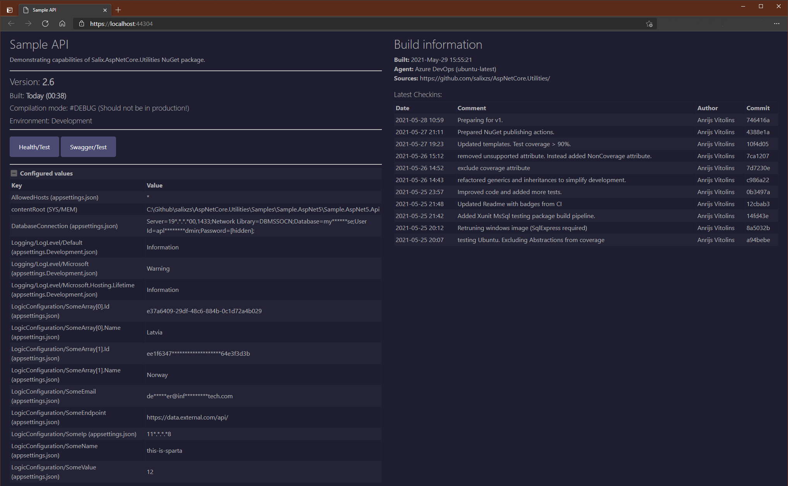

# Salix.AspNetCore.Utilities
A collection of additional functionality to Asp.Net Core framework for building better APIs.

## Description

There are few functionality extensions provided in package, allowing to better handle some task handling, when creating REST API in Asp.net Core.

These include:

* **Global Exception handler** (Json error) 
* **Health check formatter**
* **Configuration validation**
* **Home page & Health page** (w/o full MVC stack)

Package is built on .Net Standard 2.0. It is tested by using within Asp.Net Core 5 (on .Net 5) API. Sample solution is added to demonstrate its usage.

### Global error handler

Allows exceptions to be returned to API calling parties as JSON structure, adding some additional information on its type and causes (incl. CallStack when API runs in development mode). This allows to get these 400 & 500 Http Status code errors with additional information, somewhat complying to [IETF rfc7807](https://tools.ietf.org/html/rfc7807) proposed standard. Here is example on how error is returned when exception is thrown somewhere in API:
```json
{
  "type": "ServerError",
  "title": "This is thrown on purpose.",
  "status": 500,
  "requestedUrl": "/api/sample/exception",
  "errorType": 1,
  "exceptionType": "ApplicationException",
  "innerException": null,
  "innerInnerException": null,
  "stackTrace": [
    "at FaultyLogic() in Sample.AspNet5.Logic\\SampleLogic.cs: line 18",
    "at ThrowException() in Sample.AspNet5.Api\\Services\\HomeController.cs: line 110",
    "at Invoke(HttpContext httpContext) in Source\\Salix.ExceptionHandling\\ApiJsonExceptionMiddleware.cs: line 56"
  ],
  "validationErrors": []
}
```
(Stack trace is not shown when API runs in production (configurable)).

Provided functionalities can handle other types of exceptions differently, like `NotImplementedException`, `DataValidationException` and any other specific exception.

See [more extensive documentation](Documentation/GlobalErrorHandler.md) on how to use this functionality.


### Health check formatter
Custom formatter for Asp.Net HealthCheck functionalities, extending it to include additional information, like configuration values and other information which might help immediately pinpoint problem when health check is returning Degraded or Unhealthy responses. 

Example response:

```json
{
    "status": "Healthy",
    "checks": [
        {
            "key": "Database",
            "status": "Healthy",
            "description": "Database is OK.",
            "exception": null,
            "data": [
                {
                    "key": "ConnString",
                    "value": "Connection string (shown only in developer mode)"
                }
            ]
        },
        {
            "key": "ExtApi",
            "status": "Healthy",
            "description": "ExtAPI is OK.",
            "exception": null,
            "data": [
                {
                    "key": "ExtApi URL",
                    "value": "https://extapi.com/api"
                },
                {
                    "key": "User",
                    "value": "username from config"
                },
                {
                    "key": "Password",
                    "value": "password from config"
                },
                {
                    "key": "Token",
                    "value": "Secret token from config"
                }
            ]
        }
    ]
}
```

See [more extensive documentation](Documentation/HealthCheckFormatter.md) on how to use this functionality.

### Configuration validation

Provides abstract interface and service registration functionalities to check configuration values, loaded from all possible sources into `IConfiguration` from appsettings.json, user secrets, environment variables and other defined sources.

Special exception is thrown, when configuration (sections) are not passing their validations already during API startup routines to avoid nasty runtime exceptions due to mis-configuration.

See [more extensive documentation](Documentation/ConfiogurationValidation.md) on how to use this functionality.

### Root page

Default ASP.Net API provides no visible output in browser when its root is opened. Salix.AspNetCore.Utilites include simple page to show in stead of empty (usually even - 404 error) with some simple data on API.

Here is example of such page from Sample solution:




### Health check / test page

Looking at HealthCheck Json output can be problematic to grasp necessary information right away. Utilities can provide visual page for such overview, something like this:


See [more extensive documentation](Documentation/Pages.md) on how to use this functionality.


## How to use

TBD when NuGet is ready.

## Release notes
Available [in this link](Documentation/ReleaseNotes.md).